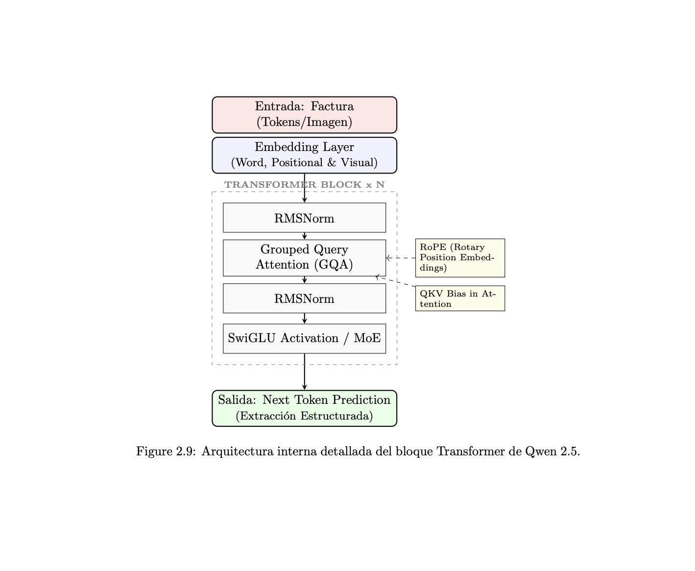

# Qwen_2.5-VL
Aplicación Estratégica de IA: Módulo de Extracción Multimodal (Qwen 2.5-VL)
Este repositorio contiene el núcleo de Inteligencia Artificial desarrollado para VINSUR, enfocado en la automatización de la captura de datos fiscales y operativos mediante modelos de lenguaje de visión de última generación.

🚀 Descripción Técnica
El motor principal utiliza la arquitectura Qwen 2.5-VL, un modelo multimodal capaz de comprender la disposición espacial de documentos complejos (facturas, notas de crédito y liquidaciones). Este módulo resuelve el problema de la captura manual mediante la transformación de imágenes/PDFs en estructuras de datos JSON altamente precisas.

Especificaciones del Modelo:

Arquitectura: Transformer Multimodal con soporte para Grouped Query Attention (GQA).

Optimización: Implementación de Cuantización de 4-bits para permitir la ejecución en entornos de memoria restringida (T4 GPU en Google Colab).

Capacidad: Procesamiento de coordenadas espaciales mediante RoPE (Rotary Position Embeddings) para detectar SKUs y montos sin importar el diseño del documento.

🛠️ Tecnologías Utilizadas
Python 3.10+

PyTorch: Motor de inferencia profunda.

Hugging Face Transformers: Gestión y carga del modelo pre-entrenado.

OpenPyXL: Interfaz de escritura para la sincronización con el Libro Maestro de Excel.

Pandas: Estructuración de datos y limpieza post-inferencia.

📈 Resultados Obtenidos
El sistema ha demostrado una tasa de acierto superior al 98% en la extracción de conceptos críticos (SKU, Subtotal, IVA), reduciendo el tiempo de procesamiento de 5 minutos manuales a <15 segundos automatizados por folio pero pueden ser más de 5 facturas.

📂 Guía de Visualización y Evidencias

Debido a la complejidad de los metadatos de los modelos multimodales, se han habilitado tres vías para consultar el trabajo:

Resultados "Congelados" (Recomendado):

Abre el archivo Qwen 2.5-VL - Colab.pdf.

Este documento contiene la ejecución íntegra con todas las gráficas, logs de inferencia y extracciones JSON ya procesadas.

Visualización Interactiva del Notebook:

Utiliza el archivo Residencias Qwen_2.5VL (Notebook).

Ideal para una revisión rápida de la estructura de las celdas sin necesidad de entornos de ejecución.

Inspección Técnica de Código (GitHub Dev):

Si tienes cuenta de GitHub, abre el archivo Qwen_2.5-VL.ipynb.

Tip Pro: Presiona la tecla . (punto) en tu teclado o cambia la URL de .com a .dev para abrir el entorno de GitHub Dev. Esto permite auditar el código fuente JSON y la lógica de programación de manera profesional.
